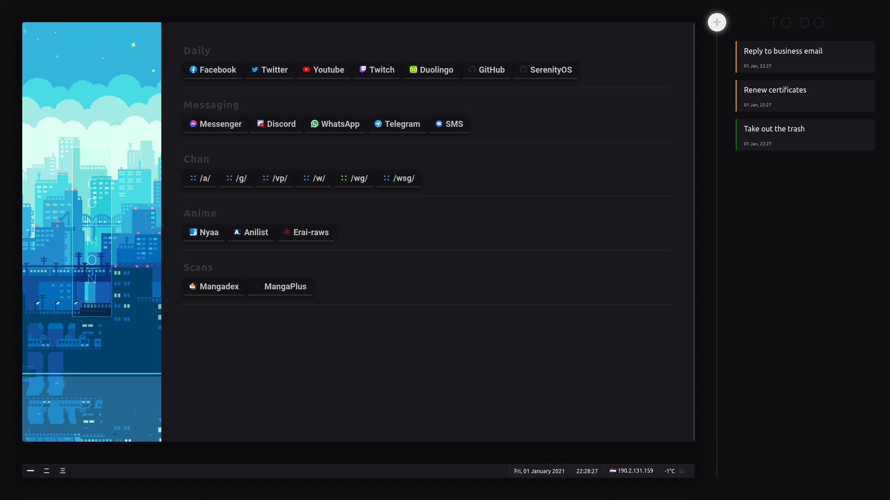

# start
A complete startpage.

Heavily inspired from [dawn](https://github.com/0-l/dawn)

## Features
- Bookshelf
	- Loading from/saving to `localStorage`
	- *[WIP]* Dynamic editing
- Powerline
	- Bookshelf's panel tabs
	- Applets
		- Date & time
		- Weather
		- IP address
	- Inline applet editing
- Todo list
	- Add & remove tasks
	- Set tasks to done/undone
- Custom context menu
- Command line
	- Parse and execute commands and sub-commands
	- *[WIP]* Dynamically autocomplete commands
	- Search (w/ customs engines)
	- Manage panels, applets, todos

## Keybindings
- `Mouse wheel X-axis` Go to next/previous panel
- `P` Open the Command-line
- `S` Open the Command-line in search mode